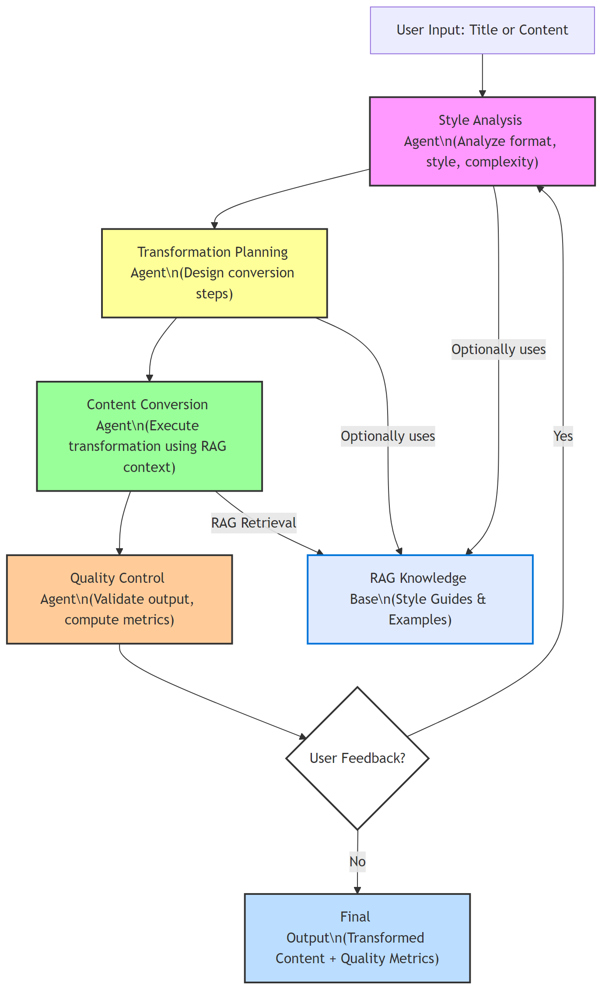

# Ultrasafe AI: Combined NLP & Content Transformation Platform

A unified platform featuring:
- **Task A:** FastAPI-powered Natural Language Processing (NLP) pipeline with advanced API endpoints, batch/asynchronous processing, and webhook notifications.
- **Task B:** Content Transformation System for style/format/complexity conversion with human-in-the-loop factual verification and a robust RAG knowledge base.

---

## Table of Contents
- [Ultrasafe AI: Combined NLP \& Content Transformation Platform](#ultrasafe-ai-combined-nlp--content-transformation-platform)
  - [Table of Contents](#table-of-contents)
  - [Overview](#overview)
  - [Environment Setup (.env)](#environment-setup-env)
- [Task A: FastAPI NLP Pipeline](#task-a-fastapi-nlp-pipeline)
  - [Key Features](#key-features)
  - [Quick Start](#quick-start)
  - [API Endpoints](#api-endpoints)
    - [Request Body (All Endpoints)](#request-body-all-endpoints)
    - [Response](#response)
  - [Batch \& Asynchronous Processing](#batch--asynchronous-processing)
  - [Webhook Notification Example](#webhook-notification-example)
  - [Performance \& Scaling](#performance--scaling)
  - [Example Usage (Python)](#example-usage-python)
- [Task B: Content Transformation System](#task-b-content-transformation-system)
  - [Key Features](#key-features-1)
  - [Quick Start](#quick-start-1)
  - [How It Works](#how-it-works)
  - [RAG Knowledge Base](#rag-knowledge-base)
  - [FAISS Index: Loading \& Querying](#faiss-index-loading--querying)
    - [Loading the Index (Python)](#loading-the-index-python)
    - [Querying the Knowledge Base](#querying-the-knowledge-base)
    - [CLI Usage](#cli-usage)
  - [Quality Metrics](#quality-metrics)
  - [Multi-Agent Workflow Diagram](#multi-agent-workflow-diagram)
- [File Structure](#file-structure)

---

## Overview

This repository provides:
- A scalable, production-ready NLP API (Task A) for classification, NER, summarization, and sentiment analysis.
- A content transformation system (Task B) that ensures factual accuracy and style/format/complexity conversion, leveraging a RAG knowledge base and human verification.

---

## Environment Setup (.env)

Store your API credentials in a `.env` file in the project root:
```
ULTRASAFE_API_KEY=your-api-key-here
ULTRASAFE_API_BASE=https://api.us.inc/usf/v1/hiring/chat/completions
```
- Replace `your-api-key-here` with your actual UltraSafe API key.
- The `ULTRASAFE_API_BASE` is usually the default shown above, but you can change it if needed.

Install `python-dotenv` and add this to the top of your main Python files to load variables automatically:
```python
from dotenv import load_dotenv
load_dotenv()
```

---

# Task A: FastAPI NLP Pipeline

## Key Features
- Unified NLP API: classification, entity extraction, summarization, sentiment analysis
- Batch processing and async endpoints
- Webhook notifications for long-running jobs
- Caching, queuing, and horizontal scaling

## Quick Start
```bash
pip install fastapi uvicorn langchain-openai httpx langchain-core python-dotenv
uvicorn Task_A:app --reload
```

## API Endpoints
| Endpoint     | Method | Description                   |
| ------------ | ------ | ----------------------------- |
| `/classify`  | POST   | Text classification           |
| `/extract`   | POST   | Named-entity extraction (NER) |
| `/summarize` | POST   | Abstractive summarization     |
| `/sentiment` | POST   | Sentiment analysis            |

### Request Body (All Endpoints)
```json
{
  "texts": "string or list of strings",
  "webhook_url": "optional webhook URL for async notification"
}
```

### Response
- **Immediate**: 200 OK with results (for short jobs)
- **Webhook**: 202 Accepted, results POSTed to webhook when ready (for long jobs)

## Batch & Asynchronous Processing
- All endpoints accept single or multiple texts.
- If `webhook_url` is provided, processing is done in the background and results are sent to the webhook.
- Otherwise, results are returned directly.

## Webhook Notification Example
```json
{
  "status": "completed",
  "detail": "Task finished successfully.",
  "webhook": "https://your-callback-url.com/notify",
  "total_texts": 5
}
```

## Performance & Scaling
- Caching, async background tasks, and horizontal scaling supported.

## Example Usage (Python)
```python
import requests

# Classification
resp = requests.post("http://localhost:8000/classify", json={"texts": ["AI is transforming tech."]})
print(resp.json())

# Batch Summarization with webhook
resp = requests.post("http://localhost:8000/summarize", json={
    "texts": ["Long article 1...", "Long article 2..."],
    "webhook_url": "https://your-callback-url.com/notify"
})
print(resp.status_code)  # 202 Accepted
```

---

# Task B: Content Transformation System

## Key Features
- Human-in-the-loop factual verification
- Style/format/complexity transformation
- RAG knowledge base for context
- Quality metrics and multi-level validation

## Quick Start
```bash
pip install -r task_b/requirements.txt
cd task_b
python improved_content_system.py
```

## How It Works
1. Generate factual master content
2. Human verifies facts and sources
3. Transform content using style guides
4. Get stylized output with quality metrics

## RAG Knowledge Base
- Built from style guides and example content
- Provides context for accurate transformations
- Ensures consistency across styles and formats

## FAISS Index: Loading & Querying
The FAISS index is used for fast retrieval of style guides and examples.

### Loading the Index (Python)
```python
from rag_knowledge_base import RAGKnowledgeBase
from langchain_openai import OpenAIEmbeddings

embeddings = OpenAIEmbeddings()
rag = RAGKnowledgeBase(embeddings)
rag.load_index("rag_faiss_index")  # Loads index from disk
```
> **Security Note:**
> As of 2024, loading the FAISS index requires `allow_dangerous_deserialization=True` due to security updates in LangChain. This is handled for you in the code. Only load indexes you trust.

### Querying the Knowledge Base
```python
results = rag.retrieve_relevant_context(
    query="How to write a Gen Z Twitter thread about meditation?",
    target_format="twitter_thread",
    target_style="gen_z",
    target_complexity="newbie",
    target_topic="meditation_for_beginners"
)

style_guides = results["style_guides"]
examples = results["examples"]
```

### CLI Usage
- The interactive CLI and demo scripts handle index loading and querying automatically.
- To rebuild or update the index, use:
```bash
python build_rag_index.py
```
And follow the prompts to rebuild, update, save, or load the index.

## Quality Metrics
- Factual accuracy
- Style adherence
- Format compliance
- Complexity match
- Readability
- Engagement

## Multi-Agent Workflow Diagram

Below is a visual overview of the agent workflow in the content transformation system:



This diagram shows how user input flows through each agent, how RAG is used for context, and how user feedback can trigger iterative improvement.

---

# File Structure
```
Task_A.py                # FastAPI NLP application
Task_A_README.md         # Task A documentation
README.md                # This file (combined)
task_b/
  ├── improved_content_system.py      # Main system with human verification
  ├── demo_improved_system.py         # Demo of the improved system
  ├── rag_knowledge_base.py           # RAG knowledge base
  ├── data_models.py                  # Data models
  ├── interactive_cli.py              # Interactive CLI interface
  ├── test_system.py                  # Test suite
  ├── requirements.txt                # Dependencies
  ├── README.md                       # Task B documentation
  └── SYSTEM_DOCUMENTATION.md         # Complete system documentation
```

---

**This platform delivers advanced, scalable, and context-aware language processing and content transformation for modern applications.** 